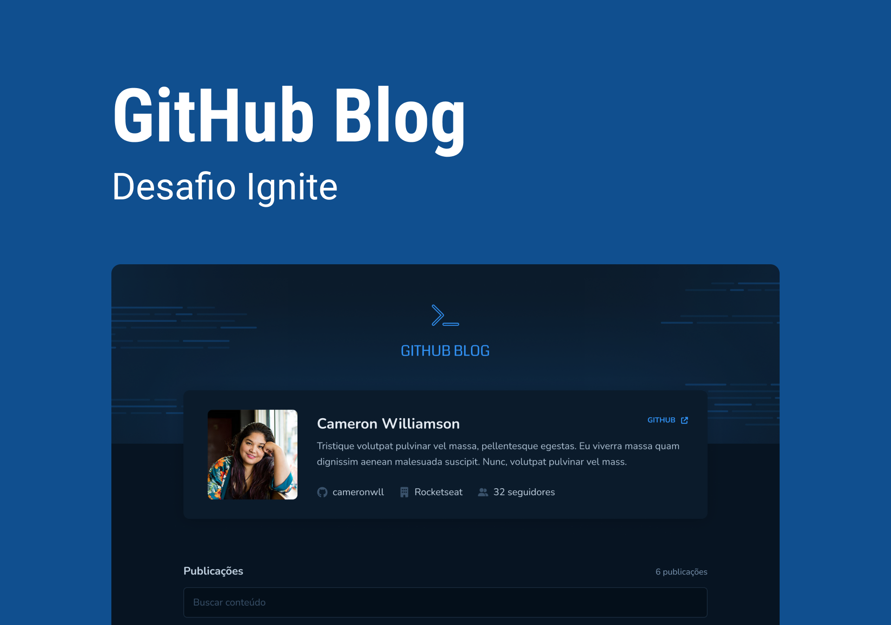

<h1 align="center">
  
</h1>

<p align="center">
  
  
  
</p>

<h1 align="center">
    GitHub Blog
</h1>
<p align="center">Blog onde os posts são issues de um repositório no GitHub</p>

<p align="center">
 <a href="#-sobre-o-projeto">Sobre o Projeto</a> •
 <a href="#-tecnologias">Tecnologias</a> •
 <a href="#-configurando-o-ambiente">Configurando o Ambiente</a> •
 <a href="#-licença">Licença</a>
</p>

## 📌 Sobre o projeto

Descrição do projeto.

---

## 💻 Tecnologias

- [React](https://reactjs.org/)
- [Typescript](https://www.typescriptlang.org/)
- [React Router](https://reactrouter.com/en/main)
- [React Hook Form](https://react-hook-form.com/)
- [Zod](https://github.com/colinhacks/zod)
- [Styled Components](https://styled-components.com/)
- [Vite](https://vitejs.dev/)

---

## 🌱 Configurando o ambiente

### 🚧 **Requisitos**

> Será necessário instalar os itens abaixo para clonar e executar o projeto corretamente!

- [Git](https://git-scm.com/)
- [Node](https://nodejs.org/)

### ⏩ **Clonando e executando a aplicação**

```bash
# Primeiro clone o repositório utilizando git:
$ git clone https://github.com/diegonatalo/github-blog.git

# Depois acesse a pasta do projeto:
$ cd github-blog

# Em seguida instale as dependências:
$ npm i

# Por fim, inicie a aplicação:
$ npm run dev
```

---

## 📜 Licença

Distribuído sob a licença MIT. Veja [LICENSE](LICENSE) para mais informações.

---

<p align="center">Feito com ❤️ por Deigo Natalo.</p>
